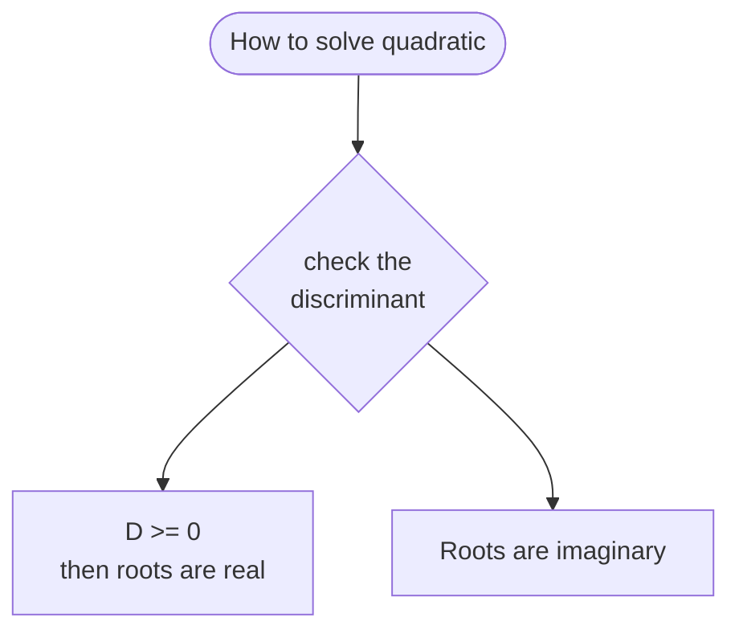

In chemical bonding, a **phase** refers to the mathematical sign—positive $(+)$ or negative $(-)$—of an electron's wave function $(\psi)$ in a given region of space.

Because electrons exhibit wave-particle duality, atomic orbitals are fundamentally 3D stationary mathematical waves. Just like water or sound waves have crests and troughs, an atomic orbital's wave function has positive and negative regions.

---

## 1. What "Phase" Means in Chemical Bonding

When two atoms approach each other to form a chemical bond, their atomic orbitals overlap. The outcome depends entirely on the **relative phases** of the overlapping wave functions:

* **In-Phase Overlap (Same Sign: $+$ with $+$, or $-$ with $-$):**
The waves combine **constructively** ($\psi_A + \psi_B$). This amplifies the wave amplitude between the nuclei, creating a high electron density zone that pulls both positively charged nuclei together. This results in a **bonding molecular orbital** (lower energy, stable bond).
* **Out-of-Phase Overlap (Opposite Signs: $+$ with $-$):**
The waves combine **destructively** ($\psi_A - \psi_B$). The amplitudes cancel each other out between the nuclei, creating a region of zero electron probability called a **nodal plane**. This produces an **antibonding molecular orbital** (higher energy, unstable).

---

## 2. Link with the Schrödinger Wave Equation

The Schrödinger equation treats electrons not as localized point-particles, but as continuous wave fields described by a **wave function** $\psi(x, y, z)$.

When you solve the Schrödinger equation for an atom, the solutions are mathematical functions called **eigenfunctions** (atomic orbitals). Every wave function $\psi$ has two defining properties:

1. **Sign/Phase ($\psi$):** The value of $\psi$ can be positive, negative, or zero. $\psi$ itself isn't directly observable, but its algebraic sign defines the **phase behavior** during orbital overlap (LCAO — *Linear Combination of Atomic Orbitals*).
2. **Probability Density ($\psi^2$):** According to Max Born's interpretation, the square of the wave function, $\vert{}\psi\vert{}^2$, represents the physical probability of finding an electron in a given volume. Notice that squaring eliminates the sign: $(+)^2 > 0$ and $(-)^2 > 0$.

> **Key takeaway:** While the sign/phase of $\psi$ disappears when measuring electron density ($\vert{}\psi\vert{}^2$), the phase is critical **during the mathematical addition of orbitals** before squaring.

---

## 3. The Schrödinger Wave Equation

### Time-Independent Schrödinger Equation (General Form)

For stationary atomic and molecular states where energy does not depend on time, the equation is written as:

$$\hat{H}\psi = E\psi$$

Where:

* $\hat{H}$ is the **Hamiltonian operator** (total kinetic $+$ potential energy operator).
* $\psi$ is the **wave function** (eigenfunction containing spatial coordinates).
* $E$ is the **total energy** of the system (eigenvalue).

---

### Expanded 3D Differential Form (Single Particle / Hydrogen-like Atom)

Expanding the Hamiltonian operator into kinetic energy derivatives and potential energy $V(x,y,z)$ yields:

$$-\frac{\hbar^2}{2m} \left( \frac{\partial^2 \psi}{\partial x^2} + \frac{\partial^2 \psi}{\partial y^2} + \frac{\partial^2 \psi}{\partial z^2} \right) + V(x,y,z)\psi = E\psi$$

Using the **Laplacian operator** $\nabla^2 = \frac{\partial^2}{\partial x^2} + \frac{\partial^2}{\partial y^2} + \frac{\partial^2}{\partial z^2}$, it simplifies to:

$$-\frac{\hbar^2}{2m} \nabla^2 \psi + V\psi = E\psi$$

Or in standard rearranged form:

$$\nabla^2 \psi + \frac{2m}{\hbar^2} \left( E - V \right) \psi = 0$$

Where:

* $\hbar = \frac{h}{2\pi}$ (reduced Planck's constant)
* $m$ is the mass of the electron
* $V$ is the electrostatic potential energy between the nucleus and electron ($V = -\frac{Z e^2}{4\pi \varepsilon_0 r}$)

---

## Summary of Bonding vs. Antibonding via $\psi$

| Property | In-Phase Overlap ($+$ with $+$, or $-$ with $-$) | Out-of-Phase Overlap ($+$ with $-$) |
| --- | --- | --- |
| **Interference** | Constructive | Destructive |
| **Wave Function** | $\psi_{\text{bonding}} = \psi_A + \psi_B$ | $\psi_{\text{antibonding}} = \psi_A - \psi_B$ |
| **Electron Density** | Increased between nuclei | Zero between nuclei (node) |
| **Orbital Type** | Bonding orbital ($\sigma, \pi$) | Antibonding orbital ($\sigma^*, \pi^*$) |
| **System Stability** | Lower energy (Stable) | Higher energy (Unstable) |

---
*Testing vs code's mermaid*

---