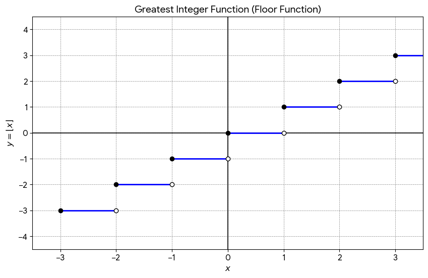

# 📌 The Greatest Integer Function (Floor Function)

The **Greatest Integer Function**, denoted as $\lfloor x \rfloor$ or $[x]$, outputs the greatest integer that is **less than or equal to** $x$. Think of it as always rounding down to the left on a number line.

---

## 🚀 Practical Usages

In the real world, this function is used whenever things change in sudden "steps" rather than smoothly:
* **Digital Communication:** Converting smooth analogue signals into distinct digital blocks (quantization).
* **Pricing Models:** Cell phone plans charging "per minute" or parking garages charging "per hour" (e.g., parking for 1 hour and 5 minutes costs the full 2-hour rate).
* **Computer Science:** Finding array index positions or managing pixel grids.

---

## 💡 Summary of Rules & Evaluation

### 1. General Logic
* **Positive Decimals:** Drop the decimal part. 
  * $\lfloor 4.8 \rfloor = 4$
* **Whole Numbers:** Stay exactly the same.
  * $\lfloor -7 \rfloor = -7$

### 2. User-Discovered Rule (For Negative Decimals) 
When $n$ is a negative number with a decimal, you can find the answer using this exact formula:
$$\lfloor n \rfloor = -(|n| \text{ without decimals} + 1)$$

**Example with $\lfloor -9.6 \rfloor$:**
1. Take absolute value: $|-9.6| = 9.6$
2. Drop the decimal: $9$
3. Add one: $9 + 1 = 10$
4. Apply negative sign: **$-10$**

---

## ⚡ Unique Examples

* **$\lfloor \pi \rfloor = 3$** (Since $\pi \approx 3.14159...$, it rounds down to $3$)
* **$\lfloor -\pi \rfloor = -4$** (Since $-\pi \approx -3.14159...$, it rounds down to $-4$)
* **$\lfloor 0.0001 \rfloor = 0$** (Even a tiny positive value drops to zero)
* **$\lfloor -0.0001 \rfloor = -1$** (Even a tiny negative value drops down to $-1$)

---

## ⚠️ Common Traps to Avoid

* **The Negative Reflex:** Thinking $\lfloor -4.3 \rfloor = -4$. *Correction:* Remember that $-5$ is smaller than $-4$. Always move left on the number line. 
* **The Whole Number Mistake:** Applying the negative decimal rule to a whole integer (e.g., mistakenly turning $\lfloor -5 \rfloor$ into $-6$). Whole integers never change.
* **Algebra Isolation:** Thinking you can just pull constants out. For example, $\lfloor 2x \rfloor$ is **not** equal to $2\lfloor x \rfloor$. 
  * *Proof:* If $x = 0.6$, then $\lfloor 2(0.6) \rfloor = \lfloor 1.2 \rfloor = 1$. But $2\lfloor 0.6 \rfloor = 2(0) = 0$.

---

# Graph:

