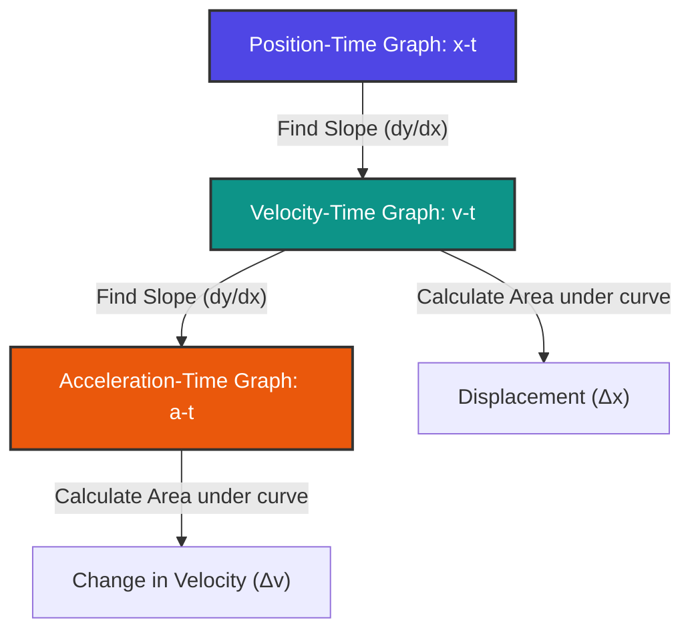
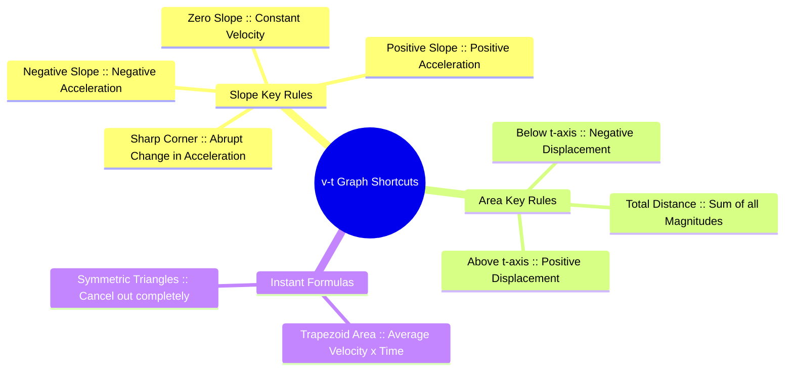
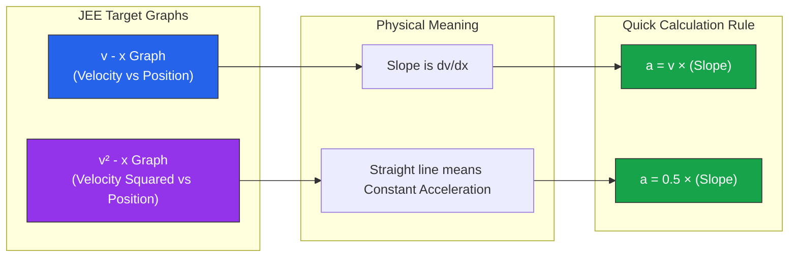

# ⚡ JEE Main Kinematics Graph Cheat Sheet

## 1. The Core Toolkit (Calculus vs. Geometry)

| Graph | Slope ($\frac{dy}{dx}$) | Area ($\int y \cdot dx$) |
| :--- | :--- | :--- |
| **Position vs. Time ($x$-$t$)** | Velocity ($v$) | *No physical meaning* |
| **Velocity vs. Time ($v$-$t$)** | Acceleration ($a$) | Change in Position / Displacement ($\Delta x$) |
| **Acceleration vs. Time ($a$-$t$)**| Jerk ($j$) | Change in Velocity ($\Delta v$) |

---

## 2. Fast Geometry Shortcuts (Skip the Formulas!)

### 🟩 Shortcut 1: The Linear Trapezoid (Average Velocity)
When velocity changes linearly from $v_1$ to $v_2$ over a time interval $\Delta t$:
$$\text{Area} = \left(\frac{v_1 + v_2}{2}\right) \times \Delta t$$
* **JEE Application:** Don't break trapezoids into a rectangle and a triangle. Just find the midpoint velocity and multiply by time.

### 🔺 Shortcut 2: Point Symmetrical Triangles (The Cancellation Trick)
If a $v$-$t$ line crosses the time axis at a constant slope:
* The positive triangle before crossing and the negative triangle after crossing cancel out if their time bases are equal.
* **JEE Application:** If $\Delta t_{\text{up}} = \Delta t_{\text{down}}$, then $\text{Displacement} = 0$. The final position equals the initial position before the sequence started.

### 🛑 Shortcut 3: Maximum/Minimum Value Identifiers
* **Maximum Position ($x_{\text{max}}$):** Occurs exactly when $v$ changes from positive to negative (where the graph crosses the $t$-axis from above to below).
* **Maximum Velocity ($v_{\text{max}}$):** Occurs exactly when $a$ changes from positive to negative (where the $a$-$t$ graph crosses the $t$-axis).

---

## 3. Advanced JEE-Specific Conversions ($v$-$x$ and $v^2$-$x$)

JEE Main frequently tests non-standard graphs like $v$-$x$ or $v^2$-$x$. Use these instant relation rules:

### 🔹 The $v$-$x$ (Velocity-Position) Graph
* To find acceleration ($a$) at any point on a $v$-$x$ graph, use: 
  $$a = v \cdot \left(\frac{dv}{dx}\right)$$
* **The Rule:** $a = (\text{Value of } v \text{ at that point}) \times (\text{Slope of the graph at that point})$.

### 🔹 The $v^2$-$x$ Graph
* If the graph of $v^2$ vs $x$ is a straight line, the motion has **constant acceleration**.
* Differentiating $v^2 = u^2 + 2ax$ gives $\frac{d(v^2)}{dx} = 2a$.
* **The Rule:** $\text{Acceleration } (a) = \frac{1}{2} \times (\text{Slope of } v^2\text{-}x \text{ graph})$.

---

## 4. The "Eliminate by Shape" Rules (Sign-Checking)

When asked to choose the correct transformed graph (e.g., convert $v$-$t$ to $x$-$t$), check these 3 things in order to eliminate wrong options instantly:

1. **Sign of Velocity $\rightarrow$ Direction of Slope:**
   * If $v > 0$ (above $t$-axis), the $x$-$t$ graph **must** have a positive slope (climbing up).
   * If $v < 0$ (below $t$-axis), the $x$-$t$ graph **must** have a negative slope (sliding down).
2. **Magnitude of Velocity $\rightarrow$ Steepness:**
   * If $|v|$ is increasing (speeding up), the $x$ vs $t$ curve must get **steeper** (curve upwards/downwards).
   * If $|v|$ is decreasing (slowing down), the $x$ vs $t$ curve must flatten out.
3. **Sharp Corners vs. Smooth Curves:**
   * A sharp corner in a $v$-$t$ graph (sudden change in slope) means acceleration abruptly changes. 
   * This results in a smooth curve transition in the $x$ vs $t$ graph, **never** a sharp point.

# Some helpful Graphs *(for quick go-through)*

## 1. The Kinematics Derivation Flowchart

## 2. \(v-t\) Graph Quick-Solving Matrix

## 3. Non-Standard Graph Troubleshooting (\(v-x\) & \(v^2-x\))

