# Vectors Cheat Sheet (Physics - JEE Main)

## 1. Fundamentals & Representation
- **Unit Vector:** Vector of magnitude 1 indicating direction.
  $$\hat{A} = \frac{\vec{A}}{|\vec{A}|}$$
- **Components in 3D:** $\vec{A} = A_x\hat{i} + A_y\hat{j} + A_z\hat{k}$
- **Magnitude:**
  $$|\vec{A}| = \sqrt{A_x^2 + A_y^2 + A_z^2}$$
- **Displacement Vector:**
  $$\vec{r}_{12} = \vec{r}_2 - \vec{r}_1 = (x_2 - x_1)\hat{i} + (y_2 - y_1)\hat{j} + (z_2 - z_1)\hat{k}$$

---

## 2. Direction Cosines
If vector $\vec{A}$ makes angles $\alpha, \beta, \gamma$ with $x, y, z$ axes:
$$\cos\alpha = \frac{A_x}{|\vec{A}|}, \quad \cos\beta = \frac{A_y}{|\vec{A}|}, \quad \cos\gamma = \frac{A_z}{|\vec{A}|}$$

**Key Identities:**
$$\cos^2\alpha + \cos^2\beta + \cos^2\gamma = 1$$
$$\sin^2\alpha + \sin^2\beta + \sin^2\gamma = 2$$

---

## 3. Vector Addition & Subtraction
### Parallelogram Law
For vectors $\vec{A}$ and $\vec{B}$ at angle $\theta$:
- **Resultant Magnitude ($R$):**
  $$R = \sqrt{A^2 + B^2 + 2AB\cos\theta}$$
- **Direction ($\alpha$ with vector $\vec{A}$):**
  $$\tan\alpha = \frac{B\sin\theta}{A + B\cos\theta}$$

| Angle ($\theta$) | Resultant Magnitude ($R$) | Condition |
| :--- | :--- | :--- |
| $0^\circ$ | $A + B$ | Maximum |
| $90^\circ$ | $\sqrt{A^2 + B^2}$ | Perpendicular |
| $180^\circ$ | $|A - B|$ | Minimum |

### Vector Subtraction
For $\vec{S} = \vec{A} - \vec{B}$:
$$|\vec{S}| = \sqrt{A^2 + B^2 - 2AB\cos\theta}$$
$$\tan\beta = \frac{B\sin\theta}{A - B\cos\theta}$$

---

## 4. Dot Product (Scalar Product)
$$\vec{A} \cdot \vec{B} = |\vec{A}||\vec{B}|\cos\theta = A_x B_x + A_y B_y + A_z B_z$$

### Key Applications
1. **Angle between two vectors:**
   $$\cos\theta = \frac{\vec{A} \cdot \vec{B}}{|\vec{A}||\vec{B}|}$$
2. **Orthogonality Condition:**
   $$\vec{A} \perp \vec{B} \iff \vec{A} \cdot \vec{B} = 0$$
3. **Projection of $\vec{A}$ on $\vec{B}$:**
   - **Scalar Projection:** $\text{Proj} = \frac{\vec{A} \cdot \vec{B}}{|\vec{B}|}$
   - **Vector Projection:** $\vec{\text{Proj}} = \left(\frac{\vec{A} \cdot \vec{B}}{|\vec{B}|^2}\right)\vec{B}$

---

## 5. Cross Product (Vector Product)
$$\vec{A} \times \vec{B} = (|\vec{A}||\vec{B}|\sin\theta)\hat{n}$$

### Matrix Form
$$\vec{A} \times \vec{B} = \begin{vmatrix} \hat{i} & \hat{j} & \hat{k} \\ A_x & A_y & A_z \\ B_x & B_y & B_z \end{vmatrix}$$

### Key Applications
1. **Anti-commutative:** $\vec{A} \times \vec{B} = -(\vec{B} \times \vec{A})$
2. **Parallel Condition:**
   $$\vec{A} \parallel \vec{B} \iff \vec{A} \times \vec{B} = \vec{0} \iff \frac{A_x}{B_x} = \frac{A_y}{B_y} = \frac{A_z}{B_z}$$
3. **Unit Normal Vector to plane containing $\vec{A}$ and $\vec{B}$:**
   $$\hat{n} = \pm \frac{\vec{A} \times \vec{B}}{|\vec{A} \times \vec{B}|}$$
4. **Areas:**
   - **Triangle (sides $\vec{A}, \vec{B}$):** $\text{Area} = \frac{1}{2}|\vec{A} \times \vec{B}|$
   - **Parallelogram (sides $\vec{A}, \vec{B}$):** $\text{Area} = |\vec{A} \times \vec{B}|$
   - **Parallelogram (diagonals $\vec{d}_1, \vec{d}_2$):** $\text{Area} = \frac{1}{2}|\vec{d}_1 \times \vec{d}_2|$

---

## 6. Lami's Theorem
For 3 concurrent, coplanar forces in equilibrium:
$$\frac{A}{\sin\alpha} = \frac{B}{\sin\beta} = \frac{C}{\sin\gamma}$$
*(Where $\alpha, \beta, \gamma$ are angles opposite to vectors $\vec{A}, \vec{B}, \vec{C}$)*

---

## 7. Relative Velocity
- **Velocity of A relative to B:**
  $$\vec{v}_{AB} = \vec{v}_A - \vec{v}_B$$
- **Magnitude:**
  $$v_{AB} = \sqrt{v_A^2 + v_B^2 - 2v_A v_B \cos\theta}$$

---

# Flowchart:

```mermaid
flowchart TD
    %% Styling Configuration
    classDef mainHeader fill:#1f2937,stroke:#3b82f6,stroke-width:2px,color:#fff,font-weight:bold;
    classDef sectionHeader fill:#111827,stroke:#10b981,stroke-width:1.5px,color:#34d399,font-weight:bold;
    classDef formulaNode fill:#1e1e2e,stroke:#89b4fa,stroke-width:1px,color:#cdd6f4;
    classDef conditionNode fill:#313244,stroke:#f9e2af,stroke-width:1px,color:#f9e2af;

    ROOT["<b>VECTORS IN PHYSICS</b><br/>Quick Reference Chart"]:::mainHeader
    
    %% Main Branches
    ROOT --> REPRESENTATION["1. Representation"]:::sectionHeader
    ROOT --> OPERATIONS["2. Basic Operations"]:::sectionHeader
    ROOT --> PRODUCTS["3. Vector Products"]:::sectionHeader
    ROOT --> APPLICATIONS["4. Physics Applications"]:::sectionHeader

    %% Representation Branch
    REPRESENTATION --> REP_3D["<b>3D Component Form</b><br/>A = A<sub>x</sub>i + A<sub>y</sub>j + A<sub>z</sub>k"]:::formulaNode
    REP_3D --> MAG["<b>Magnitude</b><br/>|A| = √(A<sub>x</sub>² + A<sub>y</sub>² + A<sub>z</sub>²)"]:::formulaNode
    REP_3D --> UNIT["<b>Unit Vector</b><br/>â = A / |A|"]:::formulaNode
    REP_3D --> COSINES["<b>Direction Cosines</b><br/>cos α = A<sub>x</sub>/|A|<br/>cos β = A<sub>y</sub>/|A|<br/>cos γ = A<sub>z</sub>/|A|"]:::formulaNode
    COSINES --> COS_ID["<b>Identity</b><br/>cos²α + cos²β + cos²γ = 1"]:::conditionNode

    %% Operations Branch
    OPERATIONS --> ADD_SUB["Vector Addition & Subtraction"]:::formulaNode
    ADD_SUB --> ADDITION["<b>Addition (R = A + B)</b><br/>R = √(A² + B² + 2AB cos θ)<br/>tan α = (B sin θ) / (A + B cos θ)"]:::formulaNode
    ADD_SUB --> SUBTRACTION["<b>Subtraction (S = A - B)</b><br/>S = √(A² + B² - 2AB cos θ)<br/>tan β = (B sin θ) / (A - B cos θ)"]:::formulaNode
    
    ADDITION --> SPECIAL_CASES{"Angle θ"}:::conditionNode
    SPECIAL_CASES -->|θ = 0°| MAX_R["R<sub>max</sub> = A + B"]:::formulaNode
    SPECIAL_CASES -->|θ = 90°| PERP_R["R = √(A² + B²)"]:::formulaNode
    SPECIAL_CASES -->|θ = 180°| MIN_R["R<sub>min</sub> = |A - B|"]:::formulaNode

    %% Products Branch
    PRODUCTS --> DOT["<b>Dot Product (Scalar)</b><br/>A · B = |A||B|cos θ<br/>= A<sub>x</sub>B<sub>x</sub> + A<sub>y</sub>B<sub>y</sub> + A<sub>z</sub>B<sub>z</sub>"]:::formulaNode
    PRODUCTS --> CROSS["<b>Cross Product (Vector)</b><br/>A × B = |A||B|sin θ n̂<br/>Anti-commutative: A × B = -(B × A)"]:::formulaNode

    DOT --> DOT_USE["<b>Uses of Dot Product</b>"]:::conditionNode
    DOT_USE --> ANGLE["<b>Angle:</b> cos θ = (A · B) / (|A||B|)"]:::formulaNode
    DOT_USE --> ORTHO["<b>Orthogonality:</b> A · B = 0  (A ⊥ B)"]:::formulaNode
    DOT_USE --> PROJ["<b>Projection of A on B:</b><br/>Scalar: (A · B) / |B|<br/>Vector: [(A · B) / |B|²] B"]:::formulaNode

    CROSS --> CROSS_USE["<b>Uses of Cross Product</b>"]:::conditionNode
    CROSS_USE --> PARALLEL["<b>Parallelism:</b> A × B = 0  (A ∥ B)<br/>A<sub>x</sub>/B<sub>x</sub> = A<sub>y</sub>/B<sub>y</sub> = A<sub>z</sub>/B<sub>z</sub>"]:::formulaNode
    CROSS_USE --> AREA["<b>Area Calculations:</b><br/>Triangle: ½ |A × B|<br/>Parallelogram: |A × B|"]:::formulaNode
    CROSS_USE --> UNIT_NORM["<b>Unit Normal:</b><br/>n̂ = ± (A × B) / |A × B|"]:::formulaNode

    %% Applications Branch
    APPLICATIONS --> LAMI["<b>Lami's Theorem</b><br/><i>(3 Forces in Equilibrium)</i><br/>A / sin α = B / sin β = C / sin γ"]:::formulaNode
    APPLICATIONS --> REL_VEL["<b>Relative Velocity</b><br/>v<sub>AB</sub> = v<sub>A</sub> - v<sub>B</sub><br/>v<sub>AB</sub> = √(v<sub>A</sub>² + v<sub>B</sub>² - 2v<sub>A</sub>v<sub>B</sub> cos θ)"]:::formulaNode
```

